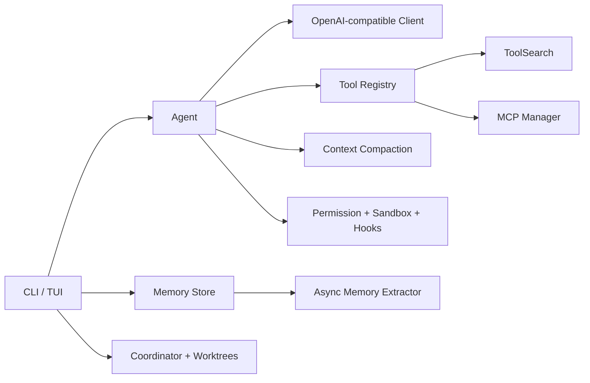

# NovaCore Architecture

## 工具执行

Agent 在每轮请求前取得 Registry 中已发现工具的 schema。工具调用先经过 Hook，再经过危险命令检测、路径沙箱和权限模式判断；交互模式下 `ask` 决策由用户确认。

## 会话与记忆

会话接近窗口上限时，旧前缀被摘要，近期消息原样保留。切分边界会向前对齐，避免拆开工具调用及其结果。长期记忆分为用户级与项目级，作为低优先级系统上下文注入新会话。

## Team

Coordinator 创建并跟踪 teammate、任务、收件箱和持久化状态。Runtime Factory 为每位 teammate 创建绑定 Worktree 的工具注册表、权限检查器和对话运行时。

